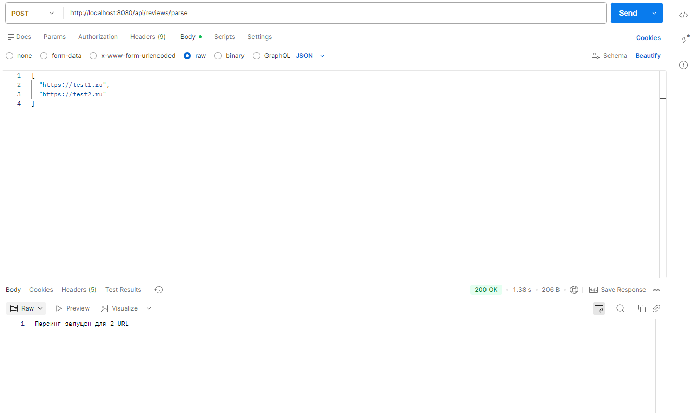
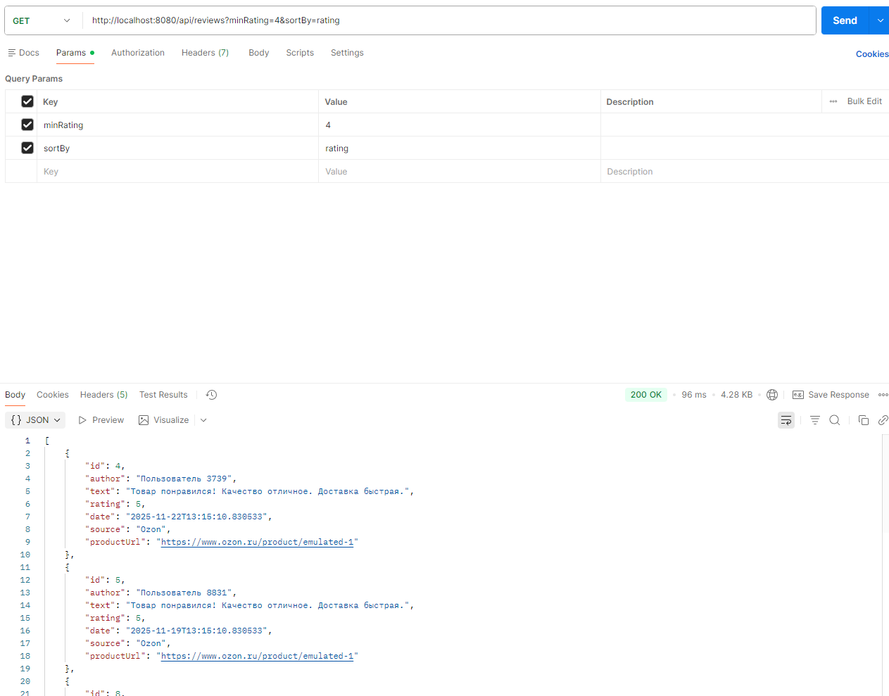

Парсер отзывов (Вариант 5)

Описание
Spring Boot приложение, эмулирующее сбор отзывов с Озона

Требования
- Java 17+
- IntelliJ IDEA (или любой IDE)
- Maven 

Как запустить

1. Откройте проект в IDEA.
2. Нажмите зелёную стрелку рядом с `public static void main(...)` в `ReviewParserApplication.java`.
3. Дождитесь сообщения: `Tomcat started on port 8080`.

Запуск парсинга

POST http://localhost:8080/api/reviews/parse
Content-Type: application/json

[
"https://test1.ru",
"https://test2.ru"
]

Получение отзывов

GET http://localhost:8080/api/reviews?minRating=4&sortBy=rating

